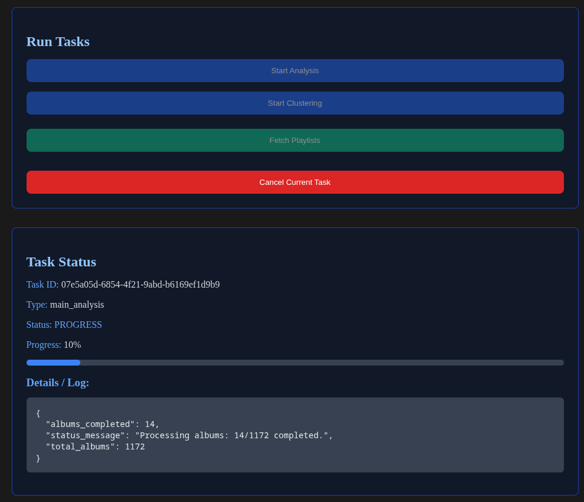
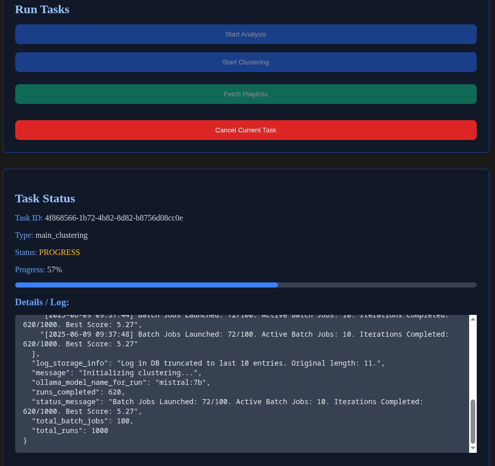
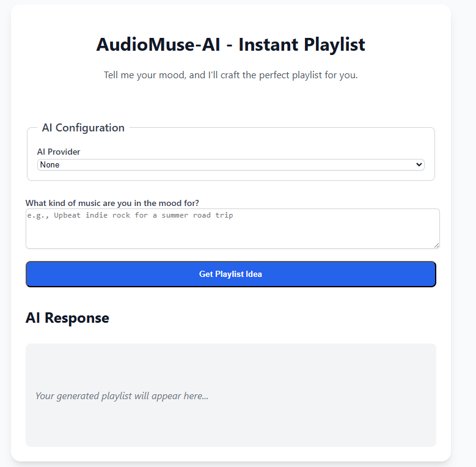
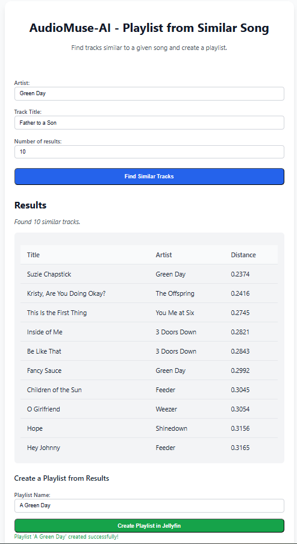

# **AudioMuse-AI - Let the choice happen, the open-source way** 

<p align="center">
  
</p>


AudioMuse-AI is an Open Source Dockerized environment that brings smart playlist generation to [Jellyfin](https://jellyfin.org) and [Navidrome](https://www.navidrome.org/) using sonic audio analysis via  [Librosa](https://github.com/librosa/librosa), [Tensorflow](https://www.tensorflow.org/)  and AI models. All you need is in a container that you can deploy locally or on your Kubernetes cluster (tested on K3S). In this repo you will find deployment example on both Kubernetes and Docker Compose.


Addional important information on this project can also be found here:
* Mkdocs version of this README.md for better visualizzation: [Neptunehub AudioMuse-AI DOCS](https://neptunehub.github.io/AudioMuse-AI/)

**IMPORTANT:** This is an **BETA** (yes we passed from ALPHA to BETA finally!) open-source project I’m developing just for fun. All the source code is fully open and visible. It’s intended only for testing purposes, not for production environments. Please use it at your own risk. I cannot be held responsible for any issues or damages that may occur.

The **supported architecture** are:
* **amd64**: Supported
* **arm64**: Supported

**The full list or AudioMuse-AI related repository are:** 
  > * [AudioMuse-AI](https://github.com/NeptuneHub/AudioMuse-AI): the core application, it run Flask and Worker containers to actually run all the feature;
  > * [AudioMuse-AI Helm Chart](https://github.com/NeptuneHub/AudioMuse-AI-helm): helm chart for easy installation on Kubernetes;
  > * [AudioMuse-AI Plugin for Jellyfin](https://github.com/NeptuneHub/audiomuse-ai-plugin): Jellyfin Plugin.


And now just some **NEWS:**
> * Version 0.6.2-beta introduce the **TOP Playlist Number** parameter for clustering tasks, let's keep only the most diverse playlists! 
> * From version 0.6.1-beta also [Navidrome](https://www.navidrome.org/) is supported.

## **Table of Contents**

- [Quick Start Deployment on K3S WITH HELM](#quick-start-deployment-on-k3s-with-helm)
- [Quick Start Deployment on K3S](#quick-start-deployment-on-k3s)
- [Front-End Quick Start: Analysis and Clustering Parameters](#front-end-quick-start-analysis-and-clustering-parameters)
- [Instant Playlist (via Chat Interface)](#instant-playlist-via-chat-interface)
- [Playlist from Similar song (via similarity Interface)](#playlist-from-similar-song-via-similarity-interface)
- [Kubernetes Deployment (K3S Example)](#kubernetes-deployment-k3s-example)
- [Configuration Parameters](#configuration-parameters)
- [Local Deployment with Docker Compose](#local-deployment-with-docker-compose)
- [Docker Image Tagging Strategy](#docker-image-tagging-strategy)
- [Workflow Overview](#workflow-overview)
- [Analysis Algorithm Deep Dive](#analysis-algorithm-deep-dive)
- [Clustering Algorithm Deep Dive](#clustering-algorithm-deep-dive)
  - [1. K-Means](#1-k-means)
  - [2. DBSCAN](#2-dbscan)
  - [3. GMM (Gaussian Mixture Models)](#3-gmm-gaussian-mixture-models)
  - [4. Spectral Clustering](#4-spectral-clustering)
  - [Montecarlo Evolutionary Approach](#montecarlo-evolutionary-approach)
  - [AI Playlist Naming](#ai-playlist-naming)
- [Concurrency Algorithm Deep Dive](#concurrency-algorithm-deep-dive)
- [Instant Chat Deep Dive](#instant-chat-deep-dive)
- [Playlist from Similar song - Deep dive](#playlist-from-similar-song---deep-dive)
- [Screenshots](#screenshots)
- [Key Technologies](#key-technologies)
- [Additional Documentation](#additional-documentation)
- [Future Possibilities](#future-possibilities)
- [How To Contribute](#how-to-contribute)
- [Contributors](#contributors)

## **Quick Start Deployment on K3S WITH HELM**

This section provides a minimal guide to deploy AudioMuse-AI on a K3S (Kubernetes) cluster WITH HELM. This is the fast way to deploy it!

*  **Prerequisites:**
    *   A running K3S cluster.
    *   `kubectl` configured to interact with your cluster.
    *   `helm` installed.

The helm chart repo is provided here:
* https://github.com/NeptuneHub/AudioMuse-AI-helm

And to easy install it you can run this command

```bash
helm repo add audiomuse-ai https://NeptuneHub.github.io/AudioMuse-AI-helm
helm repo update
helm install my-audiomuse audiomuse-ai/audiomuse-ai \
  --namespace audiomuse-ai \
  --create-namespace \
  --values my-custom-values.yaml
```

Here is a minimal configuration example for your `my-custom-values.yaml` for **Jellyfin**:

```yaml
postgres:
  user: "audiomuse"
  password: "audiomusepassword" # IMPORTANT: Change this for production
  aiChatDbUser: "ai_user"
  aiChatDbUserPassword: "ChangeThisSecurePassword123!" # IMPORTANT: Change this for production

# IMPORTANT: Set the correct Jellyfin values
jellyfin:
  userId: "0e45c44b3e2e4da7a2be11a72a1c8575"
  token: "e0b8c325bc1b426c81922b90c0aa2ff1"
  url: "http://jellyfin.192.168.3.131.nip.io:8087"

gemini:
  apiKey: "YOUR_GEMINI_API_KEY_HERE" # IMPORTANT: Change this for production

# AI Configuration
# You can use "OLLAMA", "GEMINI", or "NONE" (some features will be disabled if NONE)
config:
  mediaServerType: "jellyfin"
  aiModelProvider: "NONE" # Options: "GEMINI", "OLLAMA", or "NONE"
  ollamaServerUrl: "http://192.168.3.15:11434/api/generate"
  ollamaModelName: "mistral:7b"
  geminiModelName: "gemini-1.5-flash-latest"
  aiChatDbUserName: "ai_user" # Must match postgres.aiChatDbUser
```

How to find jellyfin **userid**:
* Log into Jellyfin from your browser as an admin
* Go to Dashboard > “admin panel” > Users.
* Click on the user’s name that you are interested
* The User ID is visible in the URL (is the part just after = ):
  * http://your-jellyfin-server/web/index.html#!/useredit.html?userId=xxxxx

How to create an the **jellyfin's API token**:
* The API Token, still as admin you can go to Dashboard > “Admin panel” > API Key and create a new one.

Here is a minimal configuration example for your `my-custom-values.yaml` for **Navidrome**:

```yaml
postgres:
  user: "audiomuse"
  password: "audiomusepassword" # IMPORTANT: Change this for production
  aiChatDbUser: "ai_user"
  aiChatDbUserPassword: "ChangeThisSecurePassword123!" # IMPORTANT: Change this for production

# IMPORTANT: Set the correct Navidrome values
navidrome:
  user: "YOUR-USER"
  password: "YOUR-PASSWORD"
  url: "http://your_navidrome_url:4533"

gemini:
  apiKey: "YOUR_GEMINI_API_KEY_HERE" # IMPORTANT: Change this for production

# AI Configuration
# You can use "OLLAMA", "GEMINI", or "NONE" (some features will be disabled if NONE)
config:
  mediaServerType: "navidrome"
  aiModelProvider: "NONE" # Options: "GEMINI", "OLLAMA", or "NONE"
  ollamaServerUrl: "http://192.168.3.15:11434/api/generate"
  ollamaModelName: "mistral:7b"
  geminiModelName: "gemini-1.5-flash-latest"
  aiChatDbUserName: "ai_user" # Must match postgres.aiChatDbUser
```

For the full list of supported configuration values, refer to the [values.yaml file](https://github.com/NeptuneHub/AudioMuse-AI-helm/blob/main/values.yaml).

For detailed documentation on each environment variable, have a look at the parameter chapter.


## **Quick Start Deployment on K3S**

This section provides a minimal guide to deploy AudioMuse-AI on a K3S (Kubernetes) cluster by using the **deployment.yaml** file that is designed for **Jellyfin**.

1.  **Prerequisites:**
    *   A running K3S cluster.
    *   `kubectl` configured to interact with your cluster.

2.  **Configuration:**
    *   Navigate to the `deployments/` directory.
    *   Edit `deployment.yaml` to configure mandatory parameters:
        *   **Secrets:**
            *   `jellyfin-credentials`: Update `api_token` and `user_id`.
            *   `postgres-credentials`: Update `POSTGRES_USER`, `POSTGRES_PASSWORD`, and `POSTGRES_DB`.
            *   `gemini-api-credentials` (if using Gemini for AI Naming): Update `GEMINI_API_KEY`.
        *   **ConfigMap (`audiomuse-ai-config`):**
            *   Update `JELLYFIN_URL`.
            *   Ensure `POSTGRES_HOST`, `POSTGRES_PORT`, and `REDIS_URL` are correct for your setup (defaults are for in-cluster services).
3.  **Deploy:**
    ```bash
    kubectl apply -f deployments/deployment.yaml
    ```
4.  **Access:**
    *   **Main UI:** Access at `http://<EXTERNAL-IP>:8000`
    *   **Instant Playlist UI:** Access at `http://<EXTERNAL-IP>:8000/chat`  **experimental**
    *   **API Docs (Swagger UI):** Explore the API at `http://<EXTERNAL-IP>:8000/apidocs`

In case you want to deploy AudioMuse-AI on K3S but interacting with Navidrome there is just some minimal configuration changes:

*  **Configuration:**
    *   Navigate to the `deployments/` directory.
    *   Edit `deployment-yaml.yaml` to configure mandatory parameters:
        *   **Secrets:**
            *   `navidrome-credentials`: Update `NAVIDROME_USER` and `NAVIDROME_PASSWORD`.
            *   `postgres-credentials`: Update `POSTGRES_USER`, `POSTGRES_PASSWORD`, and `POSTGRES_DB`.
            *   `gemini-api-credentials` (if using Gemini for AI Naming): Update `GEMINI_API_KEY`.
        *   **ConfigMap (`audiomuse-ai-config`):**
            *   Update `NAVIDROME_URL`.
            *   Ensure `POSTGRES_HOST`, `POSTGRES_PORT`, and `REDIS_URL` are correct for your setup (defaults are for in-cluster services).


## **Front-End Quick Start: Analysis and Clustering Parameters**

After deploying with the K3S Quick Start, you'll want to run an **Analysis Task** first to process your music library, followed by a **Clustering Task** to generate playlists. Here are the most important parameters to consider for your first few runs, accessible via the UI or API:

### **Analysis Task Quick Start**

1.  **`NUM_RECENT_ALBUMS`** (Default: `0`)
    *   How many of your most recently added albums to scan and analyze. Set to `0` to analyze *all* albums in your library (can take a very long time for large libraries).
    *   **Recommendation:** For a first run, you might want to set this to a smaller number (e.g., `50`, `100`) to see results quickly. For a full analysis, use `0` or a large number.

### **Clustering Task Quick Start**

1.  **`CLUSTER_ALGORITHM`** (Default: `kmeans`)
    *   **Recommendation:** For most users, especially when starting, **`kmeans`** is recommended. It's the fastest algorithm and works well when you have a general idea of the number of playlists you'd like to generate. The other algorithms (`gmm`, `dbscan`) are available for more advanced experimentation.

2.  **K-Means Specific: `NUM_CLUSTERS_MIN` & `NUM_CLUSTERS_MAX`**
    *   **`NUM_CLUSTERS_MIN`** (Default: `40`): The minimum number of playlists (clusters) the algorithm should try to create.
    *   **`NUM_CLUSTERS_MAX`** (Default: `100`): The maximum number of playlists (clusters) the algorithm should try to create. (Note: K-Means generally performs well with feature vectors).
    *   **Guidance:**
        *   Think about how many distinct playlists you'd ideally like. These parameters define the range the evolutionary algorithm will explore for the K-Means `K` value.
        *   The number of clusters cannot exceed the number of songs in the dataset being clustered for a given run. The system will automatically cap the `K` value if your `NUM_CLUSTERS_MAX` is too high for the available songs in a particular iteration's sample.
        *   For a smaller library or a quick test, you might reduce both `NUM_CLUSTERS_MIN` and `NUM_CLUSTERS_MAX` (e.g., min 10, max 30). For larger libraries, the defaults are a reasonable starting point.

3.  **`CLUSTERING_RUNS`** (Default: `5000`)
    *   This is the number of iterations the evolutionary algorithm will perform. More runs mean a more thorough search for good playlist configurations but will take longer.
    *   **Recommendation:** For a quick test, you can reduce this to `500`-`1000`. For better results, keep it high.

4.  **Scoring Weights (Primary)**:
    *   **`SCORE_WEIGHT_DIVERSITY`** (Default: `2.0`): How much to prioritize variety *between* different playlists (based on their main mood).
    *   **`SCORE_WEIGHT_PURITY`** (Default: `1.0`): How much to prioritize consistency *within* each playlist (songs matching the playlist's main mood).
    *   **Recommendation:** Start with these defaults. If you want more varied playlists, increase `SCORE_WEIGHT_DIVERSITY`. If you want playlists where songs are very similar to each other, increase `SCORE_WEIGHT_PURITY`.
    *   **Note:** Other weights like `SCORE_WEIGHT_SILHOUETTE`, `SCORE_WEIGHT_OTHER_FEATURE_DIVERSITY`, etc., default to `0.0` (disabled). They are actually there for future test and implementation

5.  **`MAX_SONGS_PER_CLUSTER`** (Default: `0` - no limit)
    *   If you want to limit the maximum number of songs in any single generated playlist, set this to a positive number (e.g., `20`, `30`). In the case of limitation is set, the algorithm will split the playlist in two or more.

6.  **AI Playlist Naming (`AI_MODEL_PROVIDER`)** (Default: `NONE`)
    *   If you've configured Ollama or Gemini (see `GEMINI_API_KEY` in secrets, and `OLLAMA_SERVER_URL` in the ConfigMap), you can set this to `OLLAMA` or `GEMINI` to get AI-generated playlist names. Otherwise, playlists will have names like "Rock_Fast_Automatic". For a first run you can keep it as `NONE`.

**To run your first tasks:**
*   Go to the UI (`http://<EXTERNAL-IP>:8000`).
*   Start Analysis: adjust `NUM_RECENT_ALBUMS` if desired, and submit. Wait for it to complete (it can takes a couple of days depending on your library size).
*   Start Clustering: Adjust the clustering parameters above as desired in the form, and Submit. Wait for it to complete (it can takes between minutes and 1-2 hours depending on your library size and the number of `CLUSTERING_RUNS`).

## **Instant PLaylist (via Chat Interface)**

**IMPORTANT:** before use this function you need to run the Analysis task first from the normal (async) UI.

For a quick and interactive way to generate playlists without running the full evolutionary clustering task, you can use the "Instant Playlist" chat interface. This feature leverages AI (Ollama or Gemini, if configured) to translate your natural language requests directly into SQL queries that are run against your analyzed music data.

**How to Use:**

1.  **Access the Chat Interface:**
    *   Navigate to `http://<EXTERNAL-IP>:8000/chat` (or `http://localhost:8000/chat` for local Docker Compose deployments).

2.  **Configure AI (Optional but Recommended):**
    *   Select your preferred AI Provider (Ollama or Gemini).
    *   If using Ollama, ensure the "Ollama Server URL" and "Ollama Model" are correctly set (they will default to values from your server configuration).
    *   If using Gemini, enter your "Gemini API Key" and select the "Gemini Model" (defaults are provided from server config).
    *   If you select "None" as the AI Provider, the system will not attempt to generate SQL from your text.

3.  **Make Your Request:**
    *   In the text area "What kind of music are you in the mood for?", type your playlist request in natural language.
    *   Click "Get Playlist Idea".

4.  **Review and Create:**
    *   The AI will generate a PostgreSQL query based on your request. This query is then executed against your `score` table.
    *   The results (a list of songs) will be displayed.
    *   If songs are found, a new section will appear allowing you to name the playlist and click "Let's do it" to create this playlist directly on your Jellyfin or Navidrome server. The playlist name on Jellyfin or Navidrome will have `_instant` appended to the name you provide.

**Example Queries (Tested with Gemini):**
*   "Create a playlist that is good for post lunch"
*   "Create a playlist for the morning POP with a good energy"
*   "Give me the tops songs of Red Hot Chili peppers"
*   "Create a mix of Metal and Hard Rock songs like AC DC, Iron Maiden"
*   "Give me some tranding songs of the radio of 2025"

**Note:** The quality and relevance of the **Instant Playlist** heavily depend on the capabilities of the configured AI model and the detail of your request. The underlying music data must have been previously analyzed using the "Analysis Task" for this feature to find songs.

## **Playlist from Similar song (via similarity Interface)**

**IMPORTANT:** before use this function you need to run the Analysis task first from the normal (async) UI.

This new functionality enable you to search the top N similar song that are similar to another one. Basically during the analysis task an Approximate Nearest Neighbors (Annoy) index is made. Then with the new similarity interface you can just search for similar song.

**How to Use:**
1.  **Access the Chat Interface:**
    *   Navigate to `http://<EXTERNAL-IP>:8000/similarity` (or `http://localhost:8000//similarity` for local Docker Compose deployments).
2.  **Input Your Song**
    *   Start writing the first 3+ letter of your favourite artist, at the third letter a search will be made helping you in finding correct Artist and song
3.  **Run the similarity search**
    *   Ask the front-end to find the similar track, it will show to you in the table
4.  **Review and Create:**
    *   Input a name for the playlist and ask the interface to create it directly on Jellyfin or Navidrome. That's it!


## **Kubernetes Deployment (K3S Example)**

The Quick Start provided in the `playlist` namespace the following resources (the same explanetion have sense for both Navidrome and Jellyfin):

**Pods (Workloads):**
*   **`audiomuse-ai-worker`**: Runs the background job processors using Redis Queue. It's recommended to run a **minimum of 2 replicas** to ensure one worker can handle main tasks while others manage subprocesses, preventing potential stalls. You can scale this based on your cluster size and workload (starting from version **v0.4.0-beta** one worker should be able to handle both main and sub tasks, so a minimum of 1 replica is enough)
*   **`audiomuse-ai-flask`**: Hosts the Flask API server and the web front-end. This is the user-facing component.
*   **`postgres-deployment`**: Manages the PostgreSQL database instance, which persists analyzed track data, playlist structures, and task status.
*   **`redis-master`**: Provides the Redis instance used by Redis Queue to manage the task queue.

**Services (Networking):**
*   **`audiomuse-ai-flask-service`**: A `LoadBalancer` service that exposes the Flask front-end externally. You can access the web UI via the external IP assigned to this service on port `8000`. Consider changing this to `ClusterIP` if you plan to use an Ingress controller.
*   **`postgres-service`**: A `ClusterIP` service allowing internal cluster communication to the PostgreSQL database from the worker and flask pods.
*   **`redis-service`**: A `ClusterIP` service allowing internal cluster communication to the Redis instance from the worker and flask pods.

**Secrets (Sensitive Configuration):**
*   **`jellyfin-credentials`**: Stores your sensitive Jellyfin `api_token` and `user_id`. **You must update this Secret with your actual values.**
*   **`postgres-credentials`**: Stores the sensitive PostgreSQL `POSTGRES_USER`, `POSTGRES_PASSWORD`, and `POSTGRES_DB` credentials. **You must update this Secret with your actual values.**
*   **`gemini-api-credentials`**: Stores your `GEMINI_API_KEY` if you configure the application to use Google Gemini for AI playlist naming. **Update this Secret if you plan to use Gemini.**

**ConfigMap (Non-Sensitive Configuration):**
*   **`audiomuse-ai-config`**: Contains non-sensitive application parameters passed as environment variables. By default, this includes `JELLYFIN_URL`, `POSTGRES_HOST`, `POSTGRES_PORT`, and `REDIS_URL`. **You must update `JELLYFIN_URL` with your Jellyfin server's address.** Ensure `POSTGRES_HOST`, `POSTGRES_PORT`, and `REDIS_URL` match the internal service names if you modify the deployment structure.

**PersistentVolumeClaim (Data Persistence):**
*   **`postgres-pvc`**: This is crucial for ensuring your PostgreSQL database data persists across pod restarts or redeployments. **Review and ensure its configuration is appropriate for your environment** to prevent data loss. Regularly backing up the database is also highly recommended.

The deployment file also creates the `playlist` namespace to contain all these resources.

For a more stable use, I suggest editing the deployment container image to use specific version tags, for example, ghcr.io/neptunehub/audiomuse-ai:0.2.2-alpha.

## **Configuration Parameters**

These are the parameters accepted for this script. You can pass them as environment variables using, for example, /deployment/deployment.yaml in this repository.

The **mandatory** parameter that you need to change from the example are this:

| Parameter          | Description                                    | Default Value                     |
|--------------------|------------------------------------------------|-----------------------------------|
| `JELLYFIN_URL`     | (Required) Your Jellyfin server's full URL     | `http://YOUR_JELLYFIN_IP:8096`    |
| `JELLYFIN_USER_ID` | (Required) Jellyfin User ID.                   | *(N/A - from Secret)* |
| `JELLYFIN_TOKEN`   | (Required) Jellyfin API Token.                 | *(N/A - from Secret)* |
| `NAVIDROME_URL`     | (Required) Your Navidrome server's full URL    | `http://YOUR_JELLYFIN_IP:4553`    |
| `NAVIDROME_USER`    | (Required) Navidrome User ID.                  | *(N/A - from Secret)* |
| `NAVIDROME_PASSWORD`| (Required) Navidrome user Password.            | *(N/A - from Secret)* |
| `POSTGRES_USER`    | (Required) PostgreSQL username.                | *(N/A - from Secret)* | # Corrected typo
| `POSTGRES_PASSWORD`| (Required) PostgreSQL password.                | *(N/A - from Secret)* |
| `POSTGRES_DB`      | (Required) PostgreSQL database name.           | *(N/A - from Secret)* |
| `POSTGRES_HOST`    | (Required) PostgreSQL host.                    | `postgres-service.playlist`       |
| `POSTGRES_PORT`    | (Required) PostgreSQL port.                    | `5432`                            |
| `REDIS_URL`        | (Required) URL for Redis.                      | `redis://localhost:6379/0`        |
| `GEMINI_API_KEY`   | (Required if `AI_MODEL_PROVIDER` is GEMINI) Your Google Gemini API Key. | *(N/A - from Secret)* |

These parameter can be leave as it is:

| Parameter               | Description                                 | Default Value                       |
| ----------------------- | ------------------------------------------- | ----------------------------------- |
| `TEMP_DIR`              | Temp directory for audio files              | `/app/temp_audio`                   |


This are the default parameters on wich the analysis or clustering task will be lunched. You will be able to change them to another value directly in the front-end:

| Parameter                                | Description                                                                  | Default Value                        |
|------------------------------------------|------------------------------------------------------------------------------|--------------------------------------|
| **Analysis General**                     |                                                                              |                                      | 
| `NUM_RECENT_ALBUMS`                      | Number of recent albums to scan (0 for all).                                 | `0`                               |
| `TOP_N_MOODS`                            | Number of top moods per track for feature vector.                            | `5`                                  |
| **Clustering General**                   |                                                                              |                                      |
| `ENABLE_CLUSTERING_EMBEDDINGS`           | Whether to use audio embeddings (True) or score-based features (False) for clustering. | `false`                              |
| `CLUSTER_ALGORITHM`                      | Default clustering: `kmeans`, `dbscan`, `gmm`, `spectral`.                             | `kmeans`                             |
| `MAX_SONGS_PER_CLUSTER`                  | Max songs per generated playlist segment.                                  | `0`                                  |
| `MAX_SONGS_PER_ARTIST`                   | Max songs from one artist per cluster.                                     | `3`                                  |
| `MAX_DISTANCE`                           | Normalized distance threshold for tracks in a cluster.                     | `0.5`                                |
| `CLUSTERING_RUNS`                        | Iterations for Monte Carlo evolutionary search.                            | `5000`                               |
| `TOP_N_PLAYLISTS`                        | POST Clustering it keep only the top N diverse playlist.                   | `8`                               |
| **Similarity General**    |                                                                              |                                      |
| `INDEX_NAME`                             | Name of the index, no need to change.                                      | `music_library`                      |
| `NUM_TREES`                              | Number of tree used by the Annoy index. More trees = higher accuracy       | `50`                                 |
| **Evolutionary Clustering & Scoring**    |                                                                              |                                      |
| `ITERATIONS_PER_BATCH_JOB`               | Number of clustering iterations processed per RQ batch job.                | `20`                                |
| `MAX_CONCURRENT_BATCH_JOBS`              | Maximum number of clustering batch jobs to run simultaneously.             | `10`                                  |
| `TOP_K_MOODS_FOR_PURITY_CALCULATION`     | Number of centroid's top moods to consider when calculating playlist purity. | `3`                                  |
| `EXPLOITATION_START_FRACTION`            | Fraction of runs before starting to use elites.                            | `0.2`                                |
| `EXPLOITATION_PROBABILITY_CONFIG`        | Probability of mutating an elite vs. random generation.                | `0.7`                                |
| `MUTATION_INT_ABS_DELTA`                 | Max absolute change for integer parameter mutation.                        | `3`                                  |
| `MUTATION_FLOAT_ABS_DELTA`               | Max absolute change for float parameter mutation.                          | `0.05`                               |
| `MUTATION_KMEANS_COORD_FRACTION`         | Fractional change for KMeans centroid coordinates.                       | `0.05`                               |
| **K-Means Ranges**                       |                                                                              |                                      |
| `NUM_CLUSTERS_MIN`                       | Min $K$ for K-Means.                                                       | `40`                                 |
| `TOP_K_MOODS_FOR_PURITY_CALCULATION`     | Number of centroid's top moods to consider when calculating playlist purity. | `3`                                  |
| `NUM_CLUSTERS_MAX`                       | Max $K$ for K-Means.                                                       | `100`                                |
| `USE_MINIBATCH_KMEANS`                   | Whether to use MiniBatchKMeans (True) or standard KMeans (False) when clustering embeddings. | `false`                               |
| **DBSCAN Ranges**                        |                                                                              |                                      |
| `DBSCAN_EPS_MIN`                         | Min epsilon for DBSCAN.                                                    | `0.1`                                |
| `DBSCAN_EPS_MAX`                         | Max epsilon for DBSCAN.                             d                       | `0.5`                                |
| `DBSCAN_MIN_SAMPLES_MIN`                 | Min `min_samples` for DBSCAN.                                              | `5`                                  |
| `DBSCAN_MIN_SAMPLES_MAX`                 | Max `min_samples` for DBSCAN.                                              | `20`                                 |
| **GMM Ranges**                           |                                                                              |                                      |
| `GMM_N_COMPONENTS_MIN`                   | Min components for GMM.                                                    | `40`                                 |
| `GMM_N_COMPONENTS_MAX`                   | Max components for GMM.                                                    | `100`                                 |
| `GMM_COVARIANCE_TYPE`                    | Covariance type for GMM (task uses `'full'`).                              | `full`                               |
| **PCA Ranges**                           |                                                                              |                                      |
| `PCA_COMPONENTS_MIN`                     | Min PCA components (0 to disable).                                         | `0`                                  |
| `PCA_COMPONENTS_MAX`                     | Max PCA components (e.g., `8` for feature vectors, `199` for embeddings).    | `8`                                  |
| **AI Naming (*)**                        |                                                                              |                                      |
| `AI_MODEL_PROVIDER`                      | AI provider: `OLLAMA`, `GEMINI`, or `NONE`.                                | `NONE`                               |
| **Evolutionary Clustering & Scoring**    |                                                                              |                                      |
| `TOP_N_ELITES`                           | Number of best solutions kept as elites.                                   | `10`                                 |
| `SAMPLING_PERCENTAGE_CHANGE_PER_RUN`     | Percentage of songs to swap out in the stratified sample between runs (0.0 to 1.0). | `0.2`                                |
| `MIN_SONGS_PER_GENRE_FOR_STRATIFICATION` | Minimum number of songs to target per stratified genre during sampling.    | `100`                                |
| `STRATIFIED_SAMPLING_TARGET_PERCENTILE`  | Percentile of genre song counts to use for target songs per stratified genre. | `50`                                 |
| `OLLAMA_SERVER_URL`                      | URL for your Ollama instance (if `AI_MODEL_PROVIDER` is OLLAMA).           | `http://<your-ip>:11434/api/generate` |
| `OLLAMA_MODEL_NAME`                      | Ollama model to use (if `AI_MODEL_PROVIDER` is OLLAMA).                    | `mistral:7b`                         |
| `GEMINI_MODEL_NAME`                      | Gemini model to use (if `AI_MODEL_PROVIDER` is GEMINI).                    | `gemini-1.5-flash-latest`            |
| **Scoring Weights**                      |                                                                              |                                      |
| `SCORE_WEIGHT_DIVERSITY`                 | Weight for inter-playlist mood diversity.                                  | `2.0`                                |
| `SCORE_WEIGHT_PURITY`                    | Weight for playlist purity (intra-playlist mood consistency).                | `1.0`                                |
| `SCORE_WEIGHT_OTHER_FEATURE_DIVERSITY`   | Weight for inter-playlist 'other feature' diversity.                       | `0.0`                                |
| `SCORE_WEIGHT_OTHER_FEATURE_PURITY`      | Weight for intra-playlist 'other feature' consistency.                     | `0.0`                                |
| `SCORE_WEIGHT_SILHOUETTE`                | Weight for Silhouette Score (cluster separation).                          | `0.0`                                |
| `SCORE_WEIGHT_DAVIES_BOULDIN`            | Weight for Davies-Bouldin Index (cluster separation).                    | `0.0`                                |
| `SCORE_WEIGHT_CALINSKI_HARABASZ`         | Weight for Calinski-Harabasz Index (cluster separation).               | `0.0`                                |


**(*)** For using GEMINI API you need to have a Google account, a free account can be used if needed. Instead if you want to self-host Ollama here you can find a deployment example:

* https://github.com/NeptuneHub/k3s-supreme-waffle/tree/main/ollama

## **Local Deployment with Docker Compose**

For a quick local setup or for users not using Kubernetes, a `docker-compose.yaml` file is provided in the `deployment/` directory for interacting with **Jellyfin**. `docker-compose-navidrome.yaml` is instead pre-compiled to interact with **Navidrome**.

**Prerequisites:**
*   Docker and Docker Compose installed.

**Steps:**
1.  **Navigate to the `deployment` directory:**
    ```bash
    cd deployment
    ```
2.  **Review and Customize (Optional):**
    The `docker-compose.yaml` and `docker-compose-navidrome.yaml` files are pre-configured with default credentials and settings suitable for local testing. You can edit environment variables within this file directly (e.g., `JELLYFIN_URL`, `JELLYFIN_USER_ID`, `JELLYFIN_TOKEN` for **Jellyfin** or `NAVIDROME_URL`, `NAVIDROME_USER` and `NAVIDROME_PASSWORD` for **Navidrome**).
3.  **Start the Services:**
    ```bash
    docker compose up -d --scale audiomuse-ai-worker=2
    ```
    This command starts all services (Flask app, RQ workers, Redis, PostgreSQL) in detached mode (`-d`). The `--scale audiomuse-ai-worker=2` ensures at least two worker instances are running, which is recommended for the task processing architecture (starting from version **v0.4.0-beta** one worker should be able to handle both main and sub tasks, so a minimum of 1 replica is enough).
4.  **Access the Application:**
    Once the containers are up, you can access the web UI at `http://localhost:8000`.
5.  **Stopping the Services:**
    ```bash
    docker compose down
    ```
## **Docker Image Tagging Strategy**

Our GitHub Actions workflow automatically builds and pushes Docker images. Here's how our tags work:

* :**latest**  
  * Builds from the **main branch**.  
  * Represents the latest stable release.  
  * **Recommended for most users.**  
* :**devel**  
  * Builds from the **devel branch**.  
  * Contains features still in development, not fully tested, and they could not work.  
  * **Use only for development.**  
* :**vX.Y.Z** (e.g., :v0.1.4-alpha, :v1.0.0)  
  * Immutable tags created from **specific Git releases/tags**.  
  * Ensures you're running a precise, versioned build.  
  * **Use for reproducible deployments or locking to a specific version.**
 
Starting from v0.6.0-beta Librosa library is used for reading song in place of Essentia. We will keep the analysis version with essentia adding the suffix **-esstentia** to the tabg for retrocompatibility.
This **-essentia** version will **not** receive additional implementation or fix on the analysis side BUT it **may** receive the other implementation. This version will be also less tested so avoid it if you don't have any specific reasion to use AudioMuse-AI implementation with essentia.


**Important version**
* **0.1.5-alpha** - Last version with the use of Sqlite and Celery. Only 1 worker admitted.
  * To deploy you can download the source code from here and use the appropriate deployment.yaml example: https://github.com/NeptuneHub/AudioMuse-AI/releases/tag/v0.1.5-alpha
* **0.2.0-alpha** - First version that use PostgreSQL database AND Redis Queue.
* **v0.3.4-beta** - First version that start to store also embeding in the database. If you pass to this version the analysis will re-scan the entire library
* **v0.5.0-beta** - Introduce song similarity function with ANNOY. If you pass to this version you need to drop all the table and re-scan the entire library with the analysis;
* **v0.6.0-beta** - Moved from Essentia to Librosa for audio feature extraction. If you pass to this version you need to drop all the table and re-scan the entire library with the analysis;

## **Workflow Overview**

This is the main workflow of how this algorithm works. For an easy way to use it, you will have a front-end reachable at **your\_ip:8000** with buttons to start/cancel the analysis (it can take hours depending on the number of songs in your Jellyfin library) and a button to create the playlist.

*   **User Initiation:** Start analysis or clustering jobs via the Flask web UI.
*   **Task Queuing:** Jobs are sent to Redis Queue for asynchronous background processing.
*   **Parallel Worker Execution:**
    *   Multiple RQ workers (at least 2 recommended) process tasks in parallel. Main tasks (e.g., full library analysis, entire evolutionary clustering process) often spawn and manage child tasks (e.g., per-album analysis, batches of clustering iterations).
    *   **Analysis Phase:**
        *   Workers fetch metadata and download audio from Jellyfin or Navidrome, processing albums individually.
        *   Librosa and TensorFlow models analyze tracks for features (tempo, key, energy) and predictions (genres, moods, etc.).
        *   Analysis results are saved to PostgreSQL.
    *   **Clustering Phase:**
        *   The option to use embeddings for clustering is currently available in the "Advanced" section of the UI.
        *   The system can use either the traditional feature vectors (derived from tempo, moods, energy, etc.) or the richer MusiCNN embeddings directly for clustering, based on user configuration.
        *   An evolutionary algorithm performs numerous clustering runs (e.g., K-Means, DBSCAN, or GMM) on the analyzed data. It explores different parameters to find optimal playlist structures based on a comprehensive scoring system.
*   **Playlist Generation & Naming:**
    *   Playlists are formed from the best clustering solution found by the evolutionary process.
    *   Optionally, AI models (Ollama or Gemini) can be used to generate creative, human-readable names for these playlists.
    *   Finalized playlists are created directly in your Jellyfin or Navidrome library.
*   **Advanced Task Management:**
    *   The web UI offers real-time monitoring of task progress, including main and sub-tasks.
    *   **Worker Supervision and High Availability:** In scenarios with multiple worker container instances, the system incorporates mechanisms to maintain high availability. HA is achived using **supervisord** and re-enquequing configuration in Redis Queue. For HA Redis and PostgreSQL must also be deployed in HA (deployment example in this repository don't cover this possibility ad the moment, so you need to change it)
    *  **Task Cancellation** A key feature is the ability to cancel tasks (both parent and child) even while they are actively running, offering robust control over long processes. This is more advanced than typical queue systems where cancellation might only affect pending tasks.


## Analysis Algorithm Deep Dive

The audio analysis in AudioMuse-AI, orchestrated by `tasks.py`, meticulously extracts a rich set of features from each track. This process is foundational for the subsequent clustering and playlist generation.
1.  **Audio Loading & Preprocessing:**
    *   Tracks are first downloaded from your Jellyfin or Navidrome library to a temporary local directory. Librosa is used then to load the audio.
    
2.  **Core Feature Extraction (Librosa):**
    *   **Tempo:** The `Tempo` algorithm analyzes the rhythmic patterns in the audio to estimate the track's tempo, expressed in Beats Per Minute (BPM).
    *   **Key & Scale:** The `Key` algorithm identifies the predominant musical key (e.g., C, G#, Bb) and scale (major or minor) of the track. This provides insights into its harmonic structure.
    *   **Energy:** The `Energy` function calculates the raw total energy of the audio signal. However, to make this feature comparable across tracks of varying lengths and overall loudness, the system computes and stores the **average energy per sample** (total energy divided by the number of samples). This normalized energy value offers a more stable representation of the track's perceived loudness or intensity.

3.  **Embedding Generation (TensorFlow & Librosa):**
    *   **MusiCNN Embeddings:** The cornerstone of the audio representation is a 200-dimensional embedding vector. This vector is generated using `TensorflowPredictMusiCNN` with the pre-trained model `msd-musicnn-1.pb` (specifically, the output from the `model/dense/BiasAdd` layer). MusiCNN is a Convolutional Neural Network (CNN) architecture that has been extensively trained on large music datasets (like the Million Song Dataset) for tasks such as music tagging. The resulting embedding is a dense, numerical summary that captures high-level semantic information and complex sonic characteristics of the track, going beyond simple acoustic features.
    *   **Important Note:** These embeddings are **always generated and saved** during the analysis phase for every track processed. This ensures they are available if you later choose to use them for clustering.

4.  **Prediction Models (TensorFlow & Librosa):**
    The rich MusiCNN embeddings serve as the input to several specialized models, each designed to predict specific characteristics of the music:
    *   **Primary Tag/Genre Prediction:**
        *   Model: `msd-msd-musicnn-1.pb`
        *   Output: This model produces a vector of probability scores. Each score corresponds to a predefined tag or genre from a list (defined by `MOOD_LABELS` in `config.py`, including labels like 'rock', 'pop', 'electronic', 'jazz', 'chillout', '80s', 'instrumental', etc.). These scores indicate the likelihood of each tag/genre being applicable to the track.
    *   **Other Feature Predictions:** The `predict_other_models` function leverages a suite of distinct models, each targeting a specific musical attribute. These models also take the MusiCNN embedding as input and typically use a `model/Softmax` output layer:
        *   `danceable`: Predicted using `danceability-msd-musicnn-1.pb`.
        *   `danceable`: Predicted using `danceability-msd-musicnn-1.pb`.
        *   `aggressive`: Predicted using `mood_aggressive-msd-musicnn-1.pb`.
        *   `happy`: Predicted using `mood_happy-msd-musicnn-1.pb`.
        *   `party`: Predicted using `mood_party-msd-musicnn-1.pb`.
        *   `relaxed`: Predicted using `mood_relaxed-msd-musicnn-1.pb`.
        *   `sad`: Predicted using `mood_sad-msd-musicnn-1.pb`.
        *   Output: Each of these models outputs a probability score (typically the probability of the positive class in a binary classification, e.g., the likelihood the track is 'danceable'). This provides a nuanced understanding of various moods and characteristics beyond the primary tags.

5.  **Feature Vector Preparation for Clustering (`score_vector` function):**
    When not using embeddings directly for clustering, all the extracted and predicted features are meticulously assembled and transformed into a single numerical vector for each track using the `score_vector` function. This is a critical step for machine learning algorithms:
    *   **Normalization:** Tempo and the calculated average energy are normalized to a 0-1 range using configured minimum/maximum values (`TEMPO_MIN_BPM`, `TEMPO_MAX_BPM`, `ENERGY_MIN`, `ENERGY_MAX`). This ensures these features have a comparable scale.
    *   **Normalization:**
        *   Tempo (BPM) and the calculated average energy per sample are normalized to a 0-1 range. This is achieved by scaling them based on predefined minimum and maximum values (e.g., `TEMPO_MIN_BPM = 40.0`, `TEMPO_MAX_BPM = 200.0`, `ENERGY_MIN = 0.01`, `ENERGY_MAX = 0.15` from `config.py`). Normalization ensures that these features, which might have vastly different original scales, contribute more equally during the initial stages of vector construction.
    *   **Vector Assembly:**
        *   The final feature vector for each track is constructed by concatenating: the normalized tempo, the normalized average energy, the vector of primary tag/genre probability scores, and the vector of other predicted feature scores (danceability, aggressive, etc.). This creates a comprehensive numerical profile of the track.
    *   **Standardization:**
        *   This complete feature vector is then standardized using `sklearn.preprocessing.StandardScaler`. Standardization transforms the data for each feature to have a zero mean and unit variance across the entire dataset. This step is particularly crucial for distance-based clustering algorithms like K-Means. It prevents features with inherently larger numerical ranges from disproportionately influencing the distance calculations, ensuring that all features contribute more equitably to the clustering process. The mean and standard deviation (scale) computed by the `StandardScaler` for each feature are saved. These saved values are used later for inverse transforming cluster centroids back to an interpretable scale, which aids in understanding the characteristics of each generated cluster.

6.  **Option to Use Embeddings Directly for Clustering:**
    *   As an alternative to the `score_vector`, AudioMuse-AI now offers the option to use the raw MusiCNN embeddings (200-dimensional vectors) directly as input for the clustering algorithms. This is controlled by the `ENABLE_CLUSTERING_EMBEDDINGS` parameter (configurable via the UI).
    *   Using embeddings directly can capture more nuanced and complex relationships between tracks, as they represent a richer, higher-dimensional summary of the audio. However, this may also require different parameter tuning for the clustering algorithms (e.g., GMM often performs well with embeddings) and can be more computationally intensive, especially with algorithms like standard K-Means (MiniBatchKMeans is used to mitigate this when embeddings are enabled). The maximum number of PCA components can also be higher when using embeddings (e.g., up to 199) compared to feature vectors (e.g., up to 8).
    *   When embeddings are used with K-Means, **MiniBatchKMeans is employed by default** (controlled by `USE_MINIBATCH_KMEANS`, default is `True`) to handle the larger data size more efficiently. MiniBatchKMeans processes data in smaller batches, making it faster and more memory-efficient for large datasets, though it might yield slightly less accurate cluster centroids compared to standard K-Means. The maximum number of PCA components can also be higher when using embeddings (e.g., up to 199) compared to feature vectors (e.g., up to 8).
    *   Regardless of the K-Means variant, embeddings are standardized using `StandardScaler` before being fed into the clustering algorithms.

**Persistence:** PostgreSQL database is used for persisting analyzed track metadata, generated playlist structures, and task status.

The use of Librosa for songs preprocessing was introduced in order to improve the compatibility with other platform (eg. `ARM64`). It is configured in order to load the same MusicNN models previously used.
Librosa loads audio using `librosa.load(file_path, sr=16000, mono=True)`, ensuring the sample rate is exactly `16,000 Hz` and the audio is converted to mono—both strict requirements of the model. It then computes a Mel spectrogram using `librosa.feature.melspectrogram` with parameters precisely matching those used during model training: `n_fft=512, hop_length=256, n_mels=96, window='hann', center=False, power=2.0, norm='slaney', htk=False`. The spectrogram is scaled using `np.log10(1 + 10000 * mel_spec)`, a transformation that must be replicated exactly. These preprocessing steps are crucial: any deviation in parameters results in incompatible input and incorrect model predictions. Once prepared, the data is passed into a frozen TensorFlow model graph using v1 compatibility mode. TensorFlow maps defined input/output tensor names and executes inference with session.run(), first generating embeddings for each patch of the spectrogram, and then passing these to various classifier heads (e.g., mood, genre). The entire pipeline depends on strict adherence to the original preprocessing parameters—without this, the model will fail to produce meaningful results.

## **Clustering Algorithm Deep Dive**

AudioMuse-AI offers three main clustering algorithms (K-Means, DBSCAN, GMM). A key feature is the ability to choose the input data for these algorithms:
*   **Score-based Feature Vectors:** The traditional approach, using a vector composed of normalized tempo, energy, mood scores, and other derived features (as described in the Analysis section). This is the default.
*   **Direct Audio Embeddings:** Using the 200-dimensional MusiCNN embeddings generated during analysis. This can provide a more nuanced clustering based on deeper audio characteristics. This option is controlled by the `ENABLE_CLUSTERING_EMBEDDINGS` parameter in the UI's "Advanced" section and configuration. GMM may perform particularly well with embeddings. When embeddings are used with K-Means, MiniBatchKMeans is employed to handle the larger data size more efficiently.

Regardless of the input data chosen, the selected clustering algorithm is executed multiple times (default 5000) following an Evolutionary Monte Carlo approach. This allows the system to test multiple configurations of parameters and find the best ones.

When chose clustering algorithm consider their complexity (speed, scalability, etc) expecially if you have big song dataset:
* So K-Means -> GMM -> DBSCAN -> Spectral (from faster to slower)

About quality it really depends from how your song are distributed. K-Means because is faster is always a good choice. GMM give good result in some test with embbeding. Spectral give also good result with embbeding but is very slow.

The TOP Playlist Number parameter was added to find the top different playlist. In short after the clustering is executed, only the N most diverse playlist are keep to avoid to have hundred of playlist created. If you put this parameter to 0, it will keep all.

Here's an explanation of the pros and cons of the different algorithms:

### **1\. K-Means**

* **Best For:** Speed, simplicity, when clusters are roughly spherical and of similar size.  
* **Pros:** Very fast (especially MiniBatchKMeans for large datasets/embeddings), scalable, clear "average" cluster profiles.  
* **Cons:** Requires knowing cluster count (K), struggles with irregular shapes, sensitive to outliers, and can be slow on large datasets (complexity is O(n*k*d*i), though MiniBatchKMeans helps).

### **2\. DBSCAN**

* **Best For:** Discovering clusters of arbitrary shapes, handling outliers well, when the number of clusters is unknown.  
* **Pros:** No need to set K, finds varied shapes, robust to noise.  
* **Cons:** Sensitive to eps and min_samples parameters, can struggle with varying cluster densities, no direct "centroids," and can be slow on large datasets (complexity is O(n log n) to O(n²)).

### **3\. GMM (Gaussian Mixture Models)**

* **Best For:** Modeling more complex, elliptical cluster shapes and when a probabilistic assignment of tracks to clusters is beneficial.  
* **Pros:** Flexible cluster shapes, "soft" assignments, model-based insights.  
* **Cons:** Requires setting number of components, computationally intensive (can be slow, with complexity of O(n*k*d²) per iteration), sensitive to initialization.

### **4. Spectral Clustering**

* **Best For:** Finding clusters with complex, non-convex shapes (e.g., intertwined genres) when the number of clusters is known beforehand.
* **Pros:** Very effective for irregular cluster geometries where distance-based algorithms like K-Means fail. It does not assume clusters are spherical.
* **Cons:** Computationally very expensive (often O(n^3) due to matrix operations), which makes it impractical for large music libraries. It also requires you to specify the number of clusters, similar to K-Means.

**Recommendation:** Start with **K-Means** (which will use MiniBatchKMeans by default if embeddings are enabled) due to its speed in the evolutionary search. MiniBatchKMeans is particularly helpful for larger libraries or when using embeddings. Experiment with **GMM** for more nuanced results, especially when using direct audio embeddings. Use **DBSCAN** if you suspect many outliers or highly irregular cluster shapes. Using a high number of runs (default 5000) helps the integrated evolutionary algorithm to find a good solution.

### Montecarlo Evolutionary Approach

AudioMuse-AI doesn't just run a clustering algorithm once; it employs a sophisticated Monte Carlo evolutionary approach, managed within `tasks.py`, to discover high-quality playlist configurations. Here's a high-level overview:

1.  **Stratified Sampling:** Before each clustering run, the system selects a subset of songs from your library. A crucial part of this selection is **stratified sampling** based on predefined genres (`STRATIFIED_GENRES` in `config.py`). This ensures that the dataset used for clustering in each iteration includes a targeted number of songs from each of these important genres.
    *   **Purpose:** This is done specifically to **avoid scenarios where genres with a low number of songs in your library are poorly represented or entirely absent** from the clustering process. By explicitly sampling from these genres, even if they have few songs, the algorithm is more likely to discover clusters relevant to them.
    *   **Tuning the Target:** The target number of songs sampled per stratified genre is dynamically determined based on the `MIN_SONGS_PER_GENRE_FOR_STRATIFICATION` and `STRATIFIED_SAMPLING_TARGET_PERCENTILE` configuration values.
        *   `MIN_SONGS_PER_GENRE_FOR_STRATIFICATION` sets a minimum floor for the target.
        *   `STRATIFIED_SAMPLING_TARGET_PERCENTILE` calculates a target based on the distribution of song counts across your stratified genres (e.g., the 25th percentile).
        *   The actual target is the maximum of these two values.
    *   **Effect:** By changing these parameters, you can **increase or decrease the emphasis** on ensuring a minimum number of songs from each stratified genre are included in every clustering iteration's dataset. A higher minimum or percentile will aim for more songs per genre (if available), potentially leading to more robust clusters for those genres but also increasing the dataset size and computation time. If a genre has fewer songs than the target, all its available songs are included.

2.  **Data Perturbation:** For subsequent runs after the first, the sampled subset isn't entirely random. A percentage of songs (`SAMPLING_PERCENTAGE_CHANGE_PER_RUN`) are randomly swapped out, while the rest are kept from the previous iteration's sample. This controlled perturbation introduces variability while retaining some continuity between runs.

3.  **Multiple Iterations:** The system performs a large number of clustering runs (defined by `CLUSTERING_RUNS`, e.g., 5000 times). In each run, it experiments with different parameters for the selected clustering algorithm (K-Means, DBSCAN, or GMM) and for Principal Component Analysis (PCA) if enabled. These parameters are initially chosen randomly within pre-defined ranges.

4.  **Evolutionary Strategy:** As the runs progress, the system "learns" from good solutions:
    *   **Elite Solutions:** The parameter sets from the best-performing runs (the "elites") are remembered.
    *   **Exploitation & Mutation:** For subsequent runs, there's a chance (`EXPLOITATION_PROBABILITY_CONFIG`) that instead of purely random parameters, the system will take an elite solution and "mutate" its parameters slightly. This involves making small, random adjustments (controlled by `MUTATION_INT_ABS_DELTA`, `MUTATION_FLOAT_ABS_DELTA`, etc.) to the elite's parameters, effectively exploring the "neighborhood" of good solutions to potentially find even better ones.

5.  **Comprehensive Scoring:** Each clustering outcome is evaluated using a composite score. This score is a weighted sum of several factors, designed to balance different aspects of playlist quality:
    *   **Playlist Diversity:** Measures how varied the predominant characteristics (e.g., moods, danceability) are across all generated playlists.
    *   **Playlist Purity:** Assesses how well the songs within each individual playlist align with that playlist's central theme or characteristic.
    *   **Internal Clustering Metrics:** Standard metrics evaluate the geometric quality of the clusters:
        *   **Silhouette Score:** How distinct are the clusters?
        *   **Davies-Bouldin Index:** How well-separated are the clusters relative to their intra-cluster similarity?
        *   **Calinski-Harabasz Index:** Ratio of between-cluster to within-cluster dispersion.


6.  **How Purity and Diversity Scores Are Calculated**

    The **Purity** and **Diversity** scores are key metrics (created for this songs clustering) used by the evolutionary algorithm to evaluate the quality of a set of playlists. These scores help balance **intra-playlist consistency** (Purity) with **inter-playlist variety** (Diversity). They are calculated in a consistent way, whether you use **interpretable score vectors** or **high-dimensional embeddings** for clustering.

    **a. Determining the Playlist’s "Personality"**

    Each playlist (or cluster) is assigned a **representative profile**—its thematic "personality"—based on how it was formed.

    - **If clustering was done using score vectors:**
        - The algorithm calculates the **centroid** of the cluster in feature vector space.
        - This centroid is reverse-mapped into interpretable attributes, such as:  
          `Tempo: 120bpm`, `Energy: 0.8`, `Mood_Rock: 75%`, `Mood_Happy: 60%`, etc.

    - **If clustering was done using embeddings:**
        - Embedding dimensions are not human-interpretable.
        - The algorithm computes the **average score vector** across all songs in the cluster (using their original interpretable features).
        - This average vector becomes the playlist’s interpretable profile.

    In both cases, the result is a readable "personality profile" that defines the core characteristics of the playlist.

    **b. Purity Score – Intra-Playlist Consistency**

    The **Purity score** answers:  
    _"How well do the songs within a playlist match its main theme?"_

    - From the playlist’s profile, the algorithm extracts:
        - The **top K mood labels**
        - The **predominant non-mood feature** (e.g., tempo, energy)
    - Each song is evaluated for how strongly it reflects these:
        - `raw_playlist_purity_component` sums the highest score a song has for any of the top moods.
        - `raw_other_feature_purity_component` sums the score for the playlist’s predominant other feature.

    These raw values are then:

    - Transformed with the natural logarithm (`np.log1p`)
    - Normalized using:
        - `LN_MOOD_PURITY_STATS`
        - `LN_OTHER_FEATURES_PURITY_STATS`

    A higher Purity score means songs in a playlist are tightly aligned to its theme.

    **c. Diversity Score – Inter-Playlist Variety**

    The **Diversity score** answers:  
    _"How different are the playlists from each other?"_

    - The algorithm looks at the **personality profiles** of all playlists.
    - It identifies unique, dominant characteristics across playlists (moods, features).
    - It then calculates:
        - `raw_mood_diversity_score`: sum of highest scores for each unique predominant mood
        - `raw_other_features_diversity_score`: same, for other features

    These scores are also:

    - Log-transformed (`np.log1p`)
    - Normalized using:
        - `LN_MOOD_DIVERSITY_STATS`
        - `LN_OTHER_FEATURES_DIVERSITY_STATS`

    > If using embeddings, alternative normalization constants are used, such as:
    >
    > - `LN_MOOD_DIVERSITY_EMBEDDING_STATS`
    > - `LN_OTHER_FEATURES_DIVERSITY_EMBEDDING_STATS`

    A higher Diversity score means playlists differ significantly from one another in theme and sound.

    **d. Final Scoring**

    The two components are combined using weighted coefficients:

    ```python
    final_score = (SCORE_WEIGHT_PURITY * purity_score) + (SCORE_WEIGHT_DIVERSITY * diversity_score)
    ```

    By adjusting `SCORE_WEIGHT_PURITY` and `SCORE_WEIGHT_DIVERSITY`, you can control whether the algorithm favors tightly themed playlists or maximally diverse collections.

7.  **Configurable Weights:** The influence of each component in the final score is determined by weights (e.g., `SCORE_WEIGHT_DIVERSITY`, `SCORE_WEIGHT_PURITY`, `SCORE_WEIGHT_SILHOUETTE`). These are defined in `config.py` and allow you to tune the algorithm to prioritize, for example, more diverse playlists over extremely pure ones, or vice-versa. 

8.  **Best Overall Solution:** After all iterations are complete, the set of parameters that yielded the highest overall composite score is chosen. The playlists generated from this top-scoring configuration are then presented and created in Jellyfin or Navidrome.

This iterative and evolutionary process allows AudioMuse-AI to automatically explore a vast parameter space and converge on a clustering solution that is well-suited to the underlying structure of your music library.

### **AI Playlist Naming**

After the clustering algorithm has identified groups of similar songs, AudioMuse-AI can optionally use an AI model to generate creative, human-readable names for the resulting playlists. This replaces the default "Mood_Tempo" naming scheme with something more evocative.

1.  **Input to AI:** For each cluster, the system extracts key characteristics derived from the cluster's centroid (like predominant moods and tempo) and provides a sample list of songs from that cluster.
2.  **AI Model Interaction:** This information is sent to a configured AI model (either a self-hosted **Ollama** instance or **Google Gemini**) along with a carefully crafted prompt.
3.  **Prompt Engineering:** The prompt guides the AI to act as a music curator and generate a concise playlist name (15-35 characters) that reflects the mood, tempo, and overall vibe of the songs, while adhering to strict formatting rules (standard ASCII characters only, no extra text).
4.  **Output Processing:** The AI's response is cleaned to ensure it meets the formatting and length constraints before being used as the final playlist name (with the `_automatic` suffix appended later by the task runner).

This step adds a layer of creativity to the purely data-driven clustering process, making the generated playlists more appealing and easier to understand at a glance. The choice of AI provider and model is configurable via environment variables and the frontend.

## Concurrency Algorithm Deep Dive

AudioMuse-AI leverages Redis Queue (RQ) to manage and execute long-running processes like audio analysis and evolutionary clustering in parallel across multiple worker nodes. This architecture, primarily orchestrated within `tasks.py`, is designed for scalability and robust task management.

1.  **Task Queuing with Redis Queue (RQ):**
    *   When a user initiates an analysis or clustering job via the web UI, the main Flask application doesn't perform the heavy lifting directly. Instead, it enqueues a task (e.g., `run_analysis_task` or `run_clustering_task`) into a Redis queue.
    *   Separate RQ worker processes, which can be scaled independently (e.g., running multiple `audiomuse-ai-worker` pods in Kubernetes), continuously monitor this queue. When a new task appears, an available worker picks it up and begins execution.

2.  **Parallel Processing on Multiple Workers:**
    *   This setup allows multiple tasks to be processed concurrently. For instance, if you have several RQ workers, they can simultaneously analyze different albums or run different batches of clustering iterations. This significantly speeds up the overall processing time, especially for large music libraries or extensive clustering runs.

3.  **Hierarchical Task Structure & Batching for Efficiency:**
    To minimize the overhead associated with frequent queue interactions (writing/reading task status, small job processing), tasks are structured hierarchically and batched:
    *   **Analysis Tasks:** The `run_analysis_task` acts as a parent task. It fetches a list of albums and then enqueues individual `analyze_album_task` jobs for each album. Each `analyze_album_task` processes all tracks within that single album. This means one "album analysis" job in the queue corresponds to the analysis of potentially many songs, reducing the number of very small, granular tasks.
    *   **Clustering Tasks:** Similarly, the main `run_clustering_task` orchestrates the evolutionary clustering. It breaks down the total number of requested clustering runs (e.g., 1000) into smaller `run_clustering_batch_task` jobs. Each batch task (e.g., `run_clustering_batch_task`) then executes a subset of these iterations (e.g., 20 iterations per batch). This strategy avoids enqueuing thousands of tiny individual clustering run tasks, again improving efficiency.

4.  **Advanced Task Monitoring and Cancellation:**
    A key feature implemented in `tasks.py` is the ability to monitor and cancel tasks *even while they are actively running*, not just when they are pending in the queue.
    *   **Cooperative Cancellation:** Both parent tasks (like `run_analysis_task` and `run_clustering_task`) and their child tasks (like `analyze_album_task` and `run_clustering_batch_task`) periodically check their own status and the status of their parent in the database.
    *   If a task sees that its own status has been set to `REVOKED` (e.g., by a user action through the UI) or if its parent task has been revoked or has failed, it will gracefully stop its current operation, perform necessary cleanup (like removing temporary files), and update its status accordingly.
    *   This is more sophisticated than typical queue systems where cancellation might only prevent a task from starting. Here, long-running iterations or album processing loops can be interrupted mid-way.

5.  **Status Tracking:**
    *   Throughout their lifecycle, tasks frequently update their progress, status (e.g., `STARTED`, `PROGRESS`, `SUCCESS`, `FAILURE`, `REVOKED`), and detailed logs into the PostgreSQL database. The Flask application reads this information to display real-time updates on the web UI.
    *   RQ's job metadata is also updated, but the primary source of truth for detailed status and logs is the application's database.

## **Instant Chat Deep Dive**

The "Instant Playlist" feature, accessible via `chat.html`, provides a direct way to generate playlists using natural language by leveraging AI models to construct and execute PostgreSQL queries against your analyzed music library.

**Core Workflow:**

1.  **User Interface (`chat.html`):**
    *   The user selects an AI provider (Ollama or Gemini) and can customize model names, Ollama server URLs, or Gemini API keys. These default to values from the server's `config.py` but can be overridden per session in the UI.
    *   The user types a natural language request (e.g., "sad songs for a rainy day" or "energetic pop from the 2020s").

2.  **API Call (`app_chat.py` - `/api/chatPlaylist`):**
    *   The frontend sends the user's input, selected AI provider, and any custom model/API parameters to this backend endpoint.

3.  **Prompt Engineering (`app_chat.py`):**
    *   A detailed system prompt (`base_expert_playlist_creator_prompt`) is used. This prompt instructs the AI model to act as an expert PostgreSQL query writer specializing in music. It includes:
        *   Strict rules for the output (SQL only, specific columns, `LIMIT 25`).
        *   The database schema for the `public.score` table.
        *   Detailed querying instructions for `mood_vector`, `other_features`, `tempo`, `energy`, and `author`.
        *   Examples of user requests and the corresponding desired SQL queries.
        *   A list of `MOOD_LABELS` and `OTHER_FEATURE_LABELS` available in the `mood_vector` and `other_features` columns.
        *   Specific instructions for handling requests for "top," "famous," or "trending" songs, suggesting the use of `CASE WHEN` in `ORDER BY` to prioritize known hits.
        *   Guidance on using `UNION ALL` for combining different criteria.
    *   The user's natural language input is appended to this master prompt.

4.  **AI Model Interaction (`ai.py` via `app_chat.py`):**
    *   Based on the selected provider, `app_chat.py` calls either `get_ollama_playlist_name` or `get_gemini_playlist_name` from `ai.py`.
    *   These functions send the complete prompt to the respective AI model (Ollama or Gemini).

5.  **SQL Query Processing (`app_chat.py` - `clean_and_validate_sql`):**
    *   The raw SQL string returned by the AI is processed:
        *   Markdown (like ```sql) is stripped.
        *   The query is normalized to start with `SELECT`.
        *   Unescaped single quotes within potential string literals (e.g., "L'amour") are escaped to `''` (e.g., "L''amour") using a regex (`re.sub(r"(\w)'(\w)", r"\1''\2", cleaned_sql)`).
        *   The string is normalized to ASCII using `unicodedata.normalize` to handle special characters.
        *   `sqlglot.parse` is used to parse the SQL (as PostgreSQL dialect). This helps validate syntax and further sanitize the query.
        *   The `LIMIT` clause is enforced to be `LIMIT 25`. If a different limit is present, it's changed; if no limit exists, it's added.
        *   The query is re-serialized by `sqlglot` to ensure a clean, valid SQL string.

6.  **Database Execution (`app_chat.py`):**
    *   Before execution, the system ensures a dedicated, restricted database user (`AI_CHAT_DB_USER_NAME` from `config.py`) exists. This user is automatically created if it doesn't exist and is granted `SELECT` ONLY permissions on the `public.score` table.
    *   The validated SQL query is executed against the PostgreSQL database using `SET LOCAL ROLE {AI_CHAT_DB_USER_NAME};`. This ensures the query runs with the restricted permissions of this AI-specific user for that transaction.

7.  **Response to Frontend (`chat.html`):**
    *   The results (list of songs: `item_id`, `title`, `author`) or any errors are sent back to `chat.html`.
    *   The frontend displays the AI's textual response (including the generated SQL and any processing messages) and the list of songs.
    *   If songs are returned, a form appears allowing the user to name the playlist. Submitting this form calls another endpoint (`/api/createJellyfinPlaylist`) in `app_chat.py` which uses the Jellyfin or Navidrome API to create the playlist with the chosen name (appended with `_instant`) and the retrieved song IDs.

## Playlist from Similar song - Deep dive

The "Playlist from Similar Song" feature provides an interactive way to discover music by finding tracks that are sonically similar to a chosen song. This process relies on a powerful combination of pre-computed audio embeddings and a specialized high-speed search index.

**Core Workflow:**

1. **Index Creation (During Analysis Task):**  
   * The foundation of this feature is an **Approximate Nearest Neighbors (ANN) index**, which is built using Spotify's **Annoy** library.  
   * During the main "Analysis Task," after the 200-dimensional MusiCNN embedding has been generated for each track, a dedicated function (build\_and\_store\_annoy\_index) is triggered.  
   * This function gathers all embeddings from the database and uses them to build the Annoy index. It uses an 'angular' distance metric, which is highly effective for comparing the "direction" of high-dimensional vectors like audio embeddings, thus capturing sonic similarity well.  
   * The completed index, which is a highly optimized data structure for fast lookups, is then saved to the PostgreSQL database. This ensures it persists and only needs to be rebuilt when new music is analyzed.  
2. **User Interface (similarity.html):**  
   * The user navigates to the /similarity page.  
   * An autocomplete search box allows the user to easily find a specific "seed" song by typing its title and/or artist. This search is powered by the /api/search\_tracks endpoint.  
3. **High-Speed Similarity Search (/api/similar\_tracks):**  
   * Once the user selects a seed song and initiates the search, the frontend calls this API endpoint with the song's unique item\_id.  
   * For maximum performance, the backend loads the Annoy index from the database into memory upon starting up (load\_annoy\_index\_for\_querying). This in-memory cache allows for near-instantaneous lookups.  
   * The core function find\_nearest\_neighbors\_by\_id takes the seed song's ID, finds its corresponding vector within the Annoy index, and instantly retrieves the *N* closest vectors (the most similar songs) based on the pre-calculated angular distances.  
   * The backend then fetches the metadata (title, artist) for these resulting song IDs from the main score table.  
4. **Playlist Creation (/api/create\_playlist):**  
   * The list of similar tracks, along with their distance from the seed song, is displayed to the user.  
   * The user can then enter a desired playlist name and click a button.  
   * This action calls the /api/create\_playlist endpoint, which takes the list of similar track IDs and the new name, and then uses the Jellyfin or Navidrome API to create the playlist directly on the server.

This entire workflow provides a fast and intuitive method for music discovery, moving beyond simple genre or tag-based recommendations to find songs that truly *sound* alike.

## Screenshots

Here are a few glimpses of AudioMuse AI in action (more can be found in /screnshot):

### Analysis task



### Clustering task



### Instant Playlist



https://github.com/user-attachments/assets/30ef6fae-ea8b-4d37-ac4c-9c07e9044114

### Similar Song Playlist




## **Key Technologies**

AudioMuse AI is built upon a robust stack of open-source technologies:

* [**Flask:**](https://flask.palletsprojects.com/) Provides the lightweight web interface for user interaction and API endpoints.  
* [**Redis Queue (RQ):**](https://redis.io/glossary/redis-queue/) A simple Python library for queueing jobs and processing them in the background with Redis. It handles the computationally intensive audio analysis and playlist generation, ensuring the web UI remains responsive.
* [**Supervisord:**](https://supervisord.org/) Supervisor is a client/server system that allows its users to monitor and control a number of processes on UNIX-like operating systems. Paired with Redis Queue is used to properly handling renquequing for High Avaiability purpose.
* [**Essentia-tensorflow**](https://essentia.upf.edu/) An open-source library for audio analysis, feature extraction, and music information retrieval. (used only until version v0.5.0-beta)
* [**MusicNN Tensorflow Audio Models from Essentia**](https://essentia.upf.edu/models.html) Leverages pre-trained MusicNN models for feature extraction and prediction. More details and models.
    *   **Embedding Model:**
        *   `msd-musicnn-1.pb`: Used for generating rich audio embeddings that capture high-level semantic information and complex sonic characteristics.
    *   **Classification Models:** Used for predicting various musical attributes from the generated embeddings:
        *   `msd-msd-musicnn-1.pb`: For primary tag/genre prediction (e.g., 'rock', 'pop', 'electronic').
        *   `danceability-msd-musicnn-1.pb`: For predicting danceability.
        *   `mood_aggressive-msd-musicnn-1.pb`: For predicting aggressiveness.
        *   `mood_happy-msd-musicnn-1.pb`: For predicting happiness.
        *   `mood_party-msd-musicnn-1.pb`: For predicting party mood.
        *   `mood_relaxed-msd-musicnn-1.pb`: For predicting relaxed mood.
        *   `mood_sad-msd-musicnn-1.pb`: For predicting sadness.
* [**Librosa**](https://github.com/librosa/librosa) Library for audio analysis, feature extraction, and music information retrieval. (used from version v0.6.0-beta)
* [**Tensorflow**](https://www.tensorflow.org/) Platform developed by Google for building, training, and deploying machine learning and deep learning models.
* [**scikit-learn**](https://scikit-learn.org/) Utilized for machine learning algorithms:
  * KMeans / DBSCAN: For clustering tracks based on their extracted features (tempo and mood vectors).  
  * PCA (Principal Component Analysis): Optionally used for dimensionality reduction before clustering, to improve performance or cluster quality.  
* [**annoy**](https://github.com/spotify/annoy) Approximate Nearest Neighbors used for the /similarity interface
* [**PostgreSQL:**](https://www.postgresql.org/) A powerful, open-source relational database used for persisting:  
  * Analyzed track metadata (tempo, key, mood vectors).  
  * Generated playlist structures.  
  * Task status for the web interface.  
* [**Ollama**](https://ollama.com/) Enables self-hosting of various open-source Large Language Models (LLMs) for tasks like intelligent playlist naming.
* [**Google Gemini API:**](https://ai.google.dev/) Provides access to Google's powerful generative AI models, used as an alternative for intelligent playlist naming.
* [**Jellyfin API**](https://jellyfin.org/) Integrates directly with your Jellyfin server to fetch media, download audio, and create/manage playlists.  
* [**Navidrome Susbsonic API**](https://www.navidrome.org/) Integrates directly with your Navidrome (or Subsonic like) server to fetch media, download audio, and create/manage playlists.  
* [**Docker / OCI-compatible Containers**](https://www.docker.com/) – The entire application is packaged as a container, ensuring consistent and portable deployment across environments.

## **Additional Documentation**

In **audiomuse-ai/docs** you can find additional documentation for this project, in details:
* **api_doc.pdf** - Is a minimal documentation of the API in case you want to integrate it in your front-end (still work in progress)
* **docker_docs.pdf** - Is a step-by-step documentation if you want to deploy everything on your local machine (debian) becuase you don't have a K3S (or other kubernetes) cluster avaiable.
  * **audiomuse-ai/deployment/docker-compose.yaml** - is the docker compose file used in the docker_docs.pdf
  

## **Future Possibilities**

This MVP lays the groundwork for further development:

* 💡 **Integration into Music Clients:** Directly used in Music Player that interacts with Jellyfin andmedia server, for playlist creation OR instant mix;  
* 🖥️ **Jellyfin Plugin:** Integration as a Jellyfin plugin to have only one and easy-to-use front-end.  
* 🔁 **Cross-Platform Sync** Export playlists to .m3u or sync to external platforms.

## **How To Contribute**

Contributions, issues, and feature requests are welcome\!  
This is a BETA early release, so expect bugs or functions that are still not implemented.


**Important:** From v.0.3.1-beta **GIT LARGE FILE** is **not** used anymore. Model was moved as an attachment of the specific release:
* https://github.com/NeptuneHub/AudioMuse-AI/releases/tag/v1.0.0-model

If you want to clone this repository remember that **GIT LARGE FILE** is used for the MusicnNN Tensorflow models (the .pb file) so you need first to install it on your local machine (supposing a debian based machine)

```
sudo apt-get install git-lfs
git clone --branch devel https://github.com/NeptuneHub/AudioMuse-AI.git
```

The large file was created in this way (in case you need to add more):
```
git lfs install
git lfs track "*.pb"
git add .gitattributes
```
## Contributors
Really thanks to all the contributors of this project, for developing, testing and giving suggestions on new feature:

- [@NovaCyntax](https://github.com/NovaCyntax) — Testing and new feature suggestions
